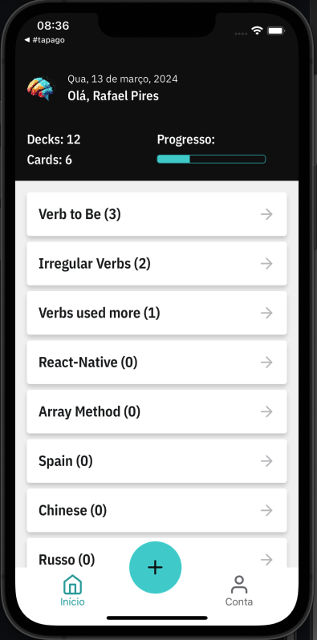

# App memorize

<h1>  </h1>

 

## 📕 About

 

Study and memorization app
 
 

## 🔨 Tools

- React-Native
- TypeScript
- Styled-components
- React-Hook-Form
- Axios
- Json Server

   
   

## 🔨 Progress

- [x] Home
- [x] New Deck
- [x] New Card
- [ ] Account
- [ ] Login
- [ ] API FireBase

 

## 📄 License

 

This project is under the MIT license. See the LICENSE file for details. [LICENSE](https://docs.github.com/pt/repositories/managing-your-repositorys-settings-and-features/customizing-your-repository/licensing-a-repository)
